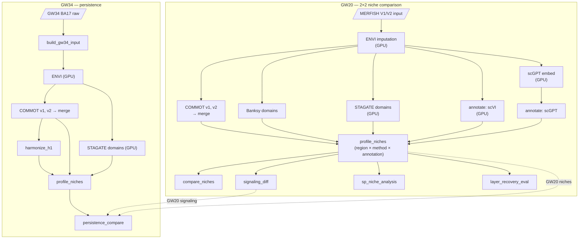

# neurospatial — spatial cell–cell communication at the V1/V2 boundary

Spatially-resolved cell–cell communication (CCC) analysis of the V1/V2 areal boundary in
the developing human cortex (Qian/Walsh et al. 2025 MERFISH atlas), with a built-in
methods comparison of standard vs. deep-learning tooling and a GW20→GW34 persistence arm.

- **Biological question:** which CCC niches distinguish V1 (BA17) from V2 (BA18) at GW20, and do they persist at GW34?
- **Methodological question:** do foundation-model annotation (scGPT) and GNN spatial domains (STAGATE) change which niches are found vs. standard tooling (scVI, Banksy)?
- Full design rationale and the running decision log live in **[PROJECT_BRIEF.md](PROJECT_BRIEF.md)**.

## The 2×2 comparison

Every pipeline arm shares one fixed ENVI→COMMOT signaling substrate; only the annotation and spatial-domain methods vary:

| | Standard annotation (scVI) | FM annotation (scGPT) |
|---|---|---|
| **Standard spatial (Banksy)** | baseline | A-only |
| **GNN spatial (STAGATE)** | B-only | A+B |

## Pipeline



Regenerate the executed DAG anytime with `nextflow run . -with-dag dag.mmd`.

## Repository layout

```
neurospatial/        # installable shared library (pure helpers: confidence, signaling, metrics, harmonization, io)
scripts/             # stage entry-point CLIs, grouped by stage
  envi/  annotation/  domains/  commot/  niches/  gw34/  viz/
modules/             # Nextflow DSL2 process per stage
main.nf              # GW20_2X2 + GW34_PERSISTENCE entry workflows
nextflow.config      # params + standard / slurm / awsbatch / test profiles
dockerfiles/         # per-stage images (4 GPU + analysis + banksy)
envs/                # captured conda env specs (neuro, scvi-annot, scgpt, stagate, banksy)
tests/               # pytest unit tests for the shared helpers
notebooks/           # exploratory analysis
PROJECT_BRIEF.md     # design doc + decision log
```

## Installation

```bash
pip install -e .            # the neurospatial package (entry scripts import from it)
pip install -e ".[dev]"     # + pytest for the test suite
```

Per-stage runtime environments are pinned in `envs/*.yml` (conda) and containerized in `dockerfiles/` — you don't install these locally; Nextflow pulls the right image/env per process. The root `environment.yml` is a **local dev** convenience only (macOS/CPU), not the cluster/GPU spec.

Build & push the images (for `slurm`/`awsbatch`):

```bash
REGISTRY=<your-registry> TAG=latest bash dockerfiles/build.sh   # builds neuro-{envi,scvi,scgpt,stagate,analysis,banksy}
# then docker push each (ECR login documented in dockerfiles/README.md)
```

## Data

Publicly available on Zenodo and CELLxGENE Discover:

- **MERFISH / Visium**: Qian et al. 2025, *Nature*. [Zenodo 14422018](https://zenodo.org/records/14422018) (CC-BY 4.0)
- **Reference scRNA-seq**: Braun et al. 2023, *Science*. [CELLxGENE Discover](https://cellxgene.cziscience.com/collections/4d8fed08-2d6d-4692-b5ea-464f1d072077)

| File | Size | Description |
|---|---|---|
| `merscope_integrated_855.h5ad` | 14.2 GB | Master integrated MERFISH object, ~15.9M cells |
| `gw34_umb5900_ba17.h5ad` | 295 MB | GW34 BA17 (V1/V2), used for the persistence arm |
| `snrna.h5ad` | — | Paired snRNA-seq reference for ENVI imputation |

Point the pipeline at your local copies via `--gw20_input`, `--gw34_raw`, `--snrna_ref`.

## Running the pipeline

```bash
# GW20 2×2 (default entry). Pick a profile: standard (local Docker) | slurm | awsbatch
nextflow run . -profile standard --gw20_input <in.h5ad> --snrna_ref <ref.h5ad> --outdir results

# GW34 persistence arm (note the coarse-layer override — GW34 has only cp/mz)
nextflow run . -profile slurm --entry gw34 --gw34_raw <ba17.h5ad> --snrna_ref <ref.h5ad> --layers cp,mz

# Dry-run the whole DAG with no compute (stub):
nextflow run . -profile test --entry gw20 -stub
nextflow run . -profile test --entry gw34 -stub --layers cp,mz
```

Profiles: **`standard`** (local Docker), **`slurm`** (SLURM executor + Singularity; per-label cpus/mem/time, `--gres=gpu:1` on GPU stages), **`awsbatch`** (AWS Batch executor; set `--queue`, `aws.region`, an S3 `workDir`, and the ECR `--registry` — ready to run once filled in), **`test`** (tiny resources for stub runs). Key params (all in `nextflow.config`, override on the CLI): `--k`, `--kmin/--kmax`, `--n_perm`, `--dis_thr`, `--layers`, `--regions`, `--methods`, `--annotations`, `--registry`, `--tag`.

## Testing

```bash
pytest -q            # 32 unit tests on the pure helpers (needs a working numpy env)
nextflow run . -profile test --entry gw20 -stub   # DAG-wiring smoke test
```

## Results (summary)

- **Spatial-method agreement:** 7–8/8 niches robust across Banksy vs. STAGATE, statistically significant (permutation p<0.05) at every k∈[6,14].
- **Annotation axis (Q1):** most of the apparent scVI-vs-scGPT composition difference was a clustering-granularity artifact (confirmed by both resolution-matching and coarse-labeling); a real residual disagreement remains only on closely-related EN-IT excitatory subtypes.
- **Subplate:** robustly EN-ET-dominated; V2↑ ECM/guidance signaling.
- **GW34 persistence:** the *compositional* V1/V2 identity persists (upper-layer EN-IT stays V1-enriched, deep-layer V2-enriched at both timepoints; signature Spearman 0.57), but the V1-vs-V2 *signaling* environment largely rewires (per-pathway effect Spearman 0.21; WNT reverses to a weak V1 bias) — see the decision log for details.
